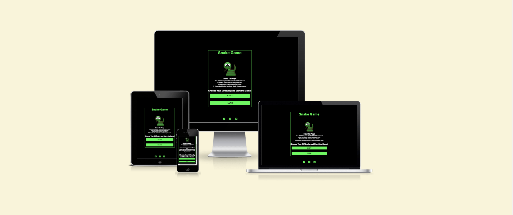
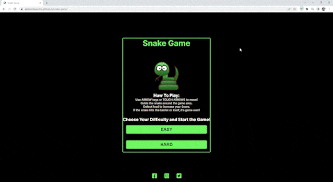
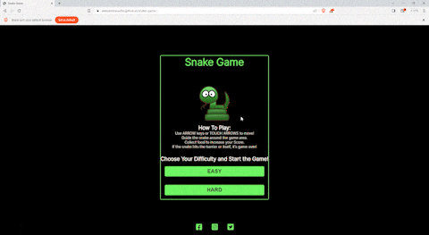
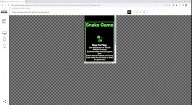
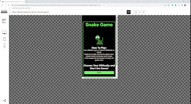
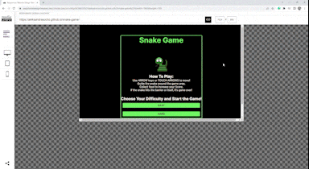
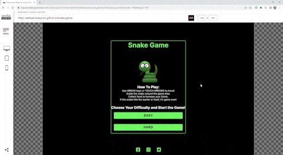

<h1 align="center">Snake Game - Project Portfolio 2</h1>

---

# *Snake Game*

A snake game is a classic game in which the player controls a snake that moves around a playing field or grid. The objective of the game is to eat food items that appear randomly on the screen, which causes the snake to grow longer. 

The site can be accessed by this [link](https://aleksandrasucho.github.io/snake-game/)



---

## User Stories

### First Time Visitor Goals:

* As a First Time Visitor, I want to  familiarize myself with the game's objective, which is usually to control the snake and eat food to grow longer. Make sure I understand the basic rules and what constitutes winning or losing.
* As a First Time Visitor, I want to learn how to control the snake's movements.
* As a First Time Visitor, I want to focus on eating the food items that appear on the screen. Each time the snake consumes food, it grows longer.
* As a First Time Visitor, I want to develop strategies to maximize the score.

### Returning Visitor Goals:

* As a Returning Visitor, I want to enjoy the game, so I can play it regularly.
* As a Returning Visitor, I want to challenge myself to surpass my previous high score. Focus on improving my strategies, reaction time, and ability to navigate the snake efficiently.
* As a Returning Visitor, I want the option of increased difficulty so I can challenge myself.

### Frequent Visitor Goals:
* As a Frequent User, I want to take my skills to the next level by mastering advanced techniques and maneuvers. 

## Features

+ ### Menu Page

    - Represent: 

        * The main goal of the game: controlling the snake to eat food and grow.
        * Instructions on how to play, including the controls and game rules.
        * Difficulty selection to start the game.

    


    - The Menu screen has the following elements:

        1. Game title and snake logo.

        1. Instructions on how to play.

        1. Difficulty selection buttons (Easy and Hard) that also start the game.

     - It also has a footer which contains social media links that open in a new tab.
     

     ---


+ ### Game Page
    The Game Screen is where all the action takes place. It provides the gameplay area where the player controls the snake to eat food and grow. It is the heart of the game, and the player spends most of their time here.

     

    - Elements of the Game Screen:
        
    
        1. Score Display:

             At the top of the Game Screen, there is a score box that keeps track of the player's current score. The score increases each time the snake successfully consumes a piece of food. Players aim to achieve higher scores with each playthrough.

             

        1. Play or Pause Control:

            This feature allows the player to manage the game. It provides three options:
            
            * Pause: When the player clicks the Pause icon, the game pauses, and the snake stops moving. This allows the player to take a break or assess the game situation.
            
            * Play (Hidden): Once the game is paused, the Pause icon is replaced with a Play icon. Clicking the Play icon resumes the game, and the snake continues its movement.

            * Stop: Clicking the Stop icon returns the player to the Game Over Screen.

            

        1. Game Grid:

            The Game Grid is a rectangular area where the snake and food are displayed. It is divided into squares, representing each cell on the grid. The snake and food move within this grid, and the player must navigate the snake across the cells to eat the food.

            

        1. On-Screen Controls:

            For players using desktop devices, the Game Screen provides on-screen controls in the form of arrow buttons. These arrow buttons (up, down, left, right) allow the player to change the snake's direction easily. Players can click these buttons to guide the snake around the grid.

            

        1. Game Over Screen:

            Although the Game Over Screen is a separate element, it is an essential part of the Game Screen. When the game ends, whether due to the snake colliding with a barrier or itself, the Game Over Screen is triggered. It displays a modal window with a "Game Over!" message and the player's final score.

            

+ ### Game Over Page

    The Game Over screen appears when the game ends (snake hits a barrier or itself).

    * The Game Over screen has the following elements:
        1. Modal window with a "Game Over!" message.
        2. Display of the player's score.
        3. Option to close the modal and return to the Menu screen.


## Future Features

###  Hammer JS Touch Controls 

* Unfortunately, due to the tight deadline, I was unable to  implement touch screen gestures with Hammer JS. Nevertheless, this functionality remains a top priority for the upcoming scheduled upgrade!

###  High Score

* A persistent display element would be added to the game screen, showcasing the user's all-time highest score. By having this prominently visible atop the current score, players would be continuously reminded of their peak performance, encouraging them to strive for better results.

## Technologies Used

- [HTML](https://developer.mozilla.org/en-US/docs/Web/HTML) was used as the foundation of the site.
- [CSS](https://developer.mozilla.org/en-US/docs/Web/css) - was used to add the styles and layout of the site.
- [CSS Flexbox](https://developer.mozilla.org/en-US/docs/Learn/CSS/CSS_layout/Flexbox) - was used to arrange items simmetrically on the pages.
- [Balsamiq](https://balsamiq.com/) was used to make wireframes for the website.
- [VSCode](https://code.visualstudio.com/) was used as the main tool to write and edit code.
- [Git](https://git-scm.com/) was used for the version control of the website.
- [GitHub](https://github.com/) was used to host the code of the website.
- [Compress PNG](https://compresspng.com/) was used to compress images.

## Design

### Color Scheme


The combination of these colors can create a striking and dynamic visual experience. The contrast between black and the vibrant lime green and red can make elements pop and draw attention, while the darker grays help balance and unify the overall composition.

### Typography


- Inter Google Font was used as the main font of the website in order to increase readability of the content on the pages.

### Wireframes

#### Mobile devices

- [Menu Page. Mobile Screen](documentation)
- [Game Page. Mobile Screen](documentation)
- [Game Over Page. Mobile Screen](documentation)


#### Tablets

- [Menu Page](documentation/tablet-menu-page-min.png)
- [Game Page](documentation/tablet-game-page-min.png)
- [Game Over Page](documentation/tablet-game-over-page-min.png)

#### Desktop

- [Menu Page](documentation/desktop-menu-page-min.png)
- [Game Page](documentation/desktop-game-page-min.png)
- [Game Over Page](documentation/desktop-game-over-page-min.png)


---

## Testing

In order to confirm the correct functionality, responsiveness, and appearance:

+ The website was tested on the following browsers: Chrome, Firefox, Brave.

    - Chrome:

    

    - FireFox:

    

    - Brave:

    


    + The website was checked by devtools implemented in Firefox and Chrome browsers.

    + The app was checked with [Responsive Website Design Tester](https://responsivedesignchecker.com/).

    1. Mobile Screens:

        - Mobile 320x480:

        

        - Mobile 320x568:

        

        - Mobile 360x640:

        

        - Mobile 375x667:

        

        - Mobile 384x640:

        

        - Mobile 411x731:

        

        - Mobile 414x736:

        

    1. Tablets Screens:

        - Tablet 600x960:
        
        

        - Tablet 768x1024:

        

        - Tablet 800x1280:
        
        

        - Tablet 1366x1024:

        

     1. Desktop Screens:

        - Desktop 1024x600:
        
        

        - Desktop 1024x800:

        

        - Desktop 1366x768:
        
        

        - Desktop 1440x900:

        

        - Desktop 1600x900:
        
        

        - Desktop 1680x1050:

        

        - Desktop 1920x1080:
        
        

        - Desktop 1920x1200:

        


+ The functionality of the links in the app was checked as well by different users.

---
​
### Bugs
+ ##### Solved bugs

    1. The game did not want to reset after playing the first time. 
        
        *Solution:* Add the ```function resetGame()```, as I forgot to write this code before. 
    ---
+ ##### Unsolved bugs
    - None.
+ ##### Mistakes
    - Mistakes were made while committing changes. I used past simple tense in commits due to the habit when I just started working on this project.
    - While progressing in my code I learned to use present simple tense in commits.

    ---
## Validator testing
+ ### HTML
  #### Menu Page
    - No errors or warnings were found when passing through the official W3C validator.


    

    ####  Page
    - No errors or warnings were found when passing through the official W3C validator.


    

  #### Gallery Page
    - No errors or warnings were found when passing through the official W3C validator.

    


